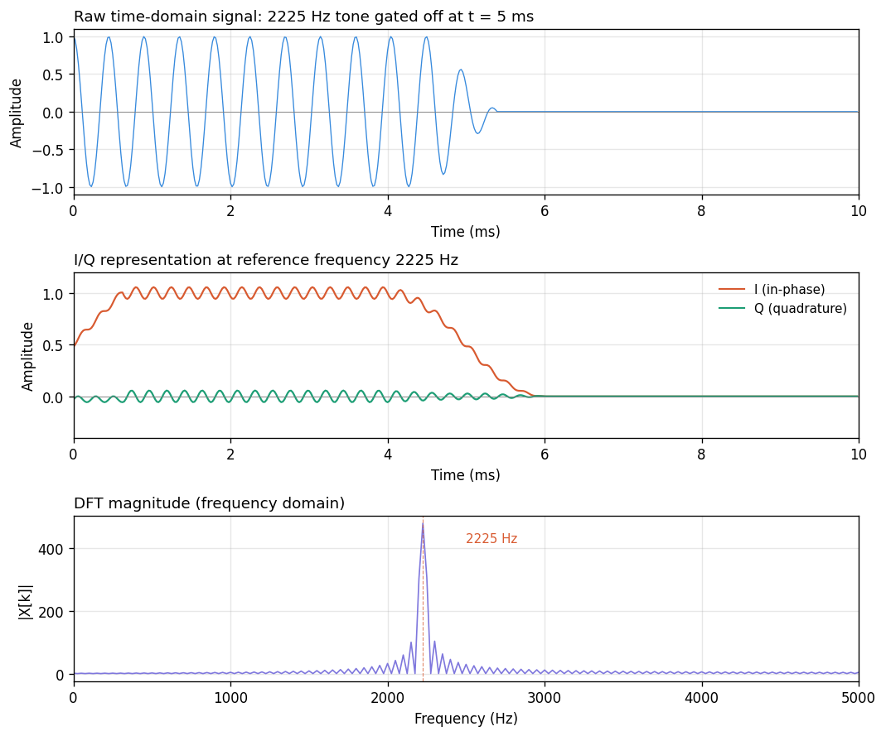

# I/Q Signals
Claude (Anthropic)

Brief notes on the *I/Q* representation: what it is, why
it's legitimate, and where it shows up. Specific
applications (tone detection, modulation) are covered
separately.

## What I/Q is

* An *I/Q pair* represents a signal as two numbers per
  sample: an *in-phase* component $I$ and a *quadrature*
  component $Q$, $90°$ apart in phase.
* Equivalently: a complex-valued sample $I + jQ$.
* **It is a time-domain representation.** One pair (or
  equivalently one complex number) per time index.
* **It is defined relative to a chosen reference frequency**
  $f_\text{ref}$. You cannot form an I/Q representation
  without picking one.
* The pair describes the signal's amplitude and phase *at
  $f_\text{ref}$, at this moment*, rather than the raw
  instantaneous signal value.

So: time-domain indexing, frequency-referenced meaning. A
time series of "how much $f_\text{ref}$ is present, and at
what phase, right now."

## Why two numbers

A sinusoid at frequency $f$ has two degrees of freedom:
amplitude $A$ and phase $\varphi$.

\begin{eqnarray*}
A~\cos(2\pi f t + \varphi) &=& A~\cos(\varphi)~\cos(2\pi f t)
   - A~\sin(\varphi)~\sin(2\pi f t) \\
   &=& I ~ \cos(2\pi f t) - Q ~ \sin(2\pi f t)
\end{eqnarray*}

with $I = A~\cos(\varphi)$ and $Q = A~\sin(\varphi)$. Recover the
original amplitude and phase as:

$$A = \sqrt{I^2 + Q^2}, \qquad \varphi = \operatorname{atan2}(Q, I)$$

A single real number per sample can't do this — amplitude
and phase are tangled together in the waveform.

## The complex-number view

Package $(I, Q)$ as $I + jQ$. Using Euler's formula
$e^{j\theta} = \cos\theta + j\sin\theta$:

$$I + jQ = A\cos\varphi + jA\sin\varphi = A \cdot e^{j\varphi}$$

* Magnitude = amplitude.
* Angle = phase.
* A complex number is a natural container for
  "amplitude-and-phase at some frequency."
* Many operations become single complex multiplications:
  * Phase rotation: multiply by $e^{j\theta}$.
  * Frequency shift: multiply by $e^{j \cdot 2\pi \Delta f \cdot t}$.
  * Amplitude scaling: multiply by a real scalar.

## Time-domain, not frequency-domain

Worth spelling out, since this is a common point of
confusion:

| Representation | Indexed by | Each sample is |
|---|---|---|
| Time-domain (raw) | time | instantaneous signal value |
| **I/Q (baseband)** | **time** | **amplitude & phase at $f_\text{ref}$** |
| Frequency-domain (DFT) | frequency | amplitude & phase at that frequency |

I/Q uses frequency concepts (amplitude, phase, reference
frequency) in its *definition*, but the resulting object is
still a time series.

Other common names for this representation:

* **Baseband signal** — the carrier at $f_\text{ref}$ has
  been "removed," leaving only the slow variations around
  it. The signal is centered at $0$ Hz (DC).
* **Complex envelope** — $I + jQ$ *is* the envelope
  (amplitude and phase) of the signal relative to the
  carrier.

## Concrete picture

A 2225 Hz tone gated off partway through:

* **Raw samples:** wiggle rapidly at 2225 Hz, with the tone
  switching off at $t = 5$ ms.
* **I/Q at $f_\text{ref} = 2225$ Hz:** sits near
  $(A, 0)$ while the tone is on, $(0, 0)$ while it's off.
  **No 2225 Hz wiggling** — it got absorbed into the
  reference. Only the slow envelope remains. (The residual
  ripple is an artifact of the finite lowpass filter used
  to produce I/Q; a sharper filter removes it.)
* **DFT:** one complex number per frequency bin. Energy
  concentrated near 2225 Hz. No time information — you
  can't tell from the DFT alone when the tone was on or
  off.

I/Q is the middle view: same time resolution as raw
samples, but the fast carrier is gone and only the slow
modulation remains.

## Connection to the DFT

This is where most students trip, and it's worth making
explicit. A DFT output bin is a complex number $X[k]$. A
complex-valued sample in an I/Q stream is also a complex
number. **Are these the same thing?** Yes, in the
following precise sense.

A DFT output bin is:

$$X[k] = \sum_{n=0}^{N-1} x[n] \cdot e^{-j \cdot 2\pi k n / N}
      = I_k + jQ_k$$

Writing that out in real and imaginary parts:

$$I_k = \sum_n {x[n]~\cos(2\pi k n / N)}, \qquad
  Q_k = -\sum_n {x[n]~\sin(2\pi k n / N)}$$

These are exactly the I/Q components of the signal at
reference frequency $f_k = k f_s / N$, summed over the
block. So:

* **Each DFT output bin is an I/Q pair** at that bin's
  frequency.
* $|X[k]|$ is the amplitude at $f_k$; $\angle X[k]$ is the
  phase at $f_k$.
* **A DFT is "compute one I/Q pair per frequency, for $N$
  frequencies simultaneously."** The FFT is a fast
  algorithm for doing this.

This also explains why DFT *inputs* are allowed to be
complex-valued: they might themselves be I/Q streams, in
which case the DFT is analyzing a baseband signal. For
real-valued inputs (audio, voltages), you just set the
imaginary part to zero; the DFT's output is complex either
way.

## How you get I/Q in practice

Two common paths:

* **Multiply (mix) and lowpass.** Multiply the real signal
  by $\cos(2\pi f_\text{ref} t)$ to get $I$, by
  $-\sin(2\pi f_\text{ref} t)$ to get $Q$, then lowpass
  each to kill the sum-frequency image. Produces a
  continuous I/Q stream at the original sample rate. This
  is how software-defined radios, lock-in amplifiers, and
  superheterodyne receivers work internally.
* **Correlate over a block.** Sum $x[n]\cos(\cdot)$ and
  $x[n]\sin(\cdot)$ over a block of $N$ samples to get one
  $(I, Q)$ pair per block. This is what a DFT bin, a
  Goertzel filter, and a matched-filter tone detector all
  compute.

First path: one I/Q pair per input sample. Second path: one
pair per block of $N$ samples (downsampled by $N$). Both
are legitimately I/Q.

## Where I/Q shows up

Once you start looking, it's everywhere:

* **Modems and digital radio.** QAM, PSK, OFDM — all
  modulation schemes that encode bits as amplitude-and-phase
  transmit and receive in I/Q.
* **Software-defined radio.** SDR hardware delivers I/Q
  samples at baseband; all demodulation, filtering, and
  decoding happens on the complex stream.
* **DFT/FFT internals.** As above: every bin is an I/Q pair
  at that bin's frequency.
* **Lock-in amplifiers.** Standard lab technique for pulling
  a tiny signal at a known frequency out of noise. Literally
  an I/Q correlator in hardware.
* **Phase-locked loops.** Track a reference by driving $Q$
  to zero.
* **Radar and sonar.** Pulse-compression and Doppler
  processing both operate on I/Q.
* **MRI.** The scanner acquires I/Q data; images reconstruct
  from the complex k-space representation.

## Things to carry forward

* I/Q is a time series of (amplitude, phase) measurements
  at a chosen reference frequency.
* Packaging the pair as a complex number is a convenience,
  not a deep statement — but it does make a lot of algebra
  cleaner.
* You must commit to a reference frequency before you have
  I/Q at all. Different reference → different
  representation of the same signal.
* A DFT output bin is an I/Q pair at that bin's frequency.
  A DFT computes $N$ such pairs in one shot.
* When a DSP algorithm seems mysteriously to want complex
  numbers even though your input is clearly real, the
  answer is almost always "because it's really operating
  in I/Q at some reference frequency, even if nobody said
  so."
